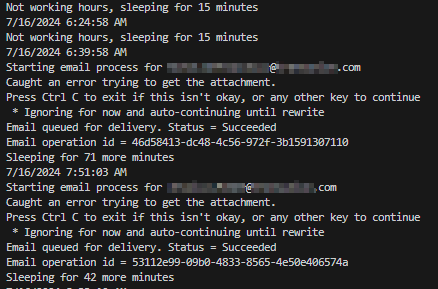
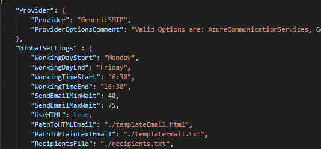
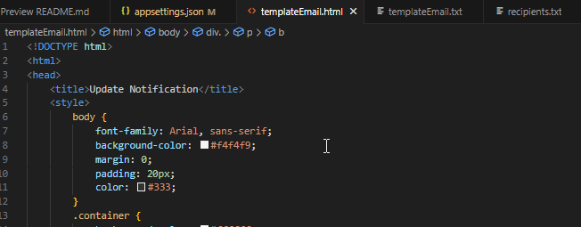

# Turtle Mailer


## Description
Turt(le) Mail is a TU RT tool to build phishing emails and slowly schedule the send of that email through Azure Communication Services and other Email send providers. 

Features include:
- Sends emails based on a list of email addresses provided
- Emails are sent 1 every 40 to 75 minutes (Definable numbers)
- Emails are only sent during defined working hours (Definable : M - F, 9 - 5)

## Visuals

While running, output will indicate timing and actions taken. This output will be captured in the future and written as a log file (someday). 



## Installation

The tool is written in, and therfore requires, [.NET 8.0](https://dotnet.microsoft.com/en-us/download). 

## Usage
First, edit the appsettings.json file to fit your needs. This includes defining what provider you'll use to send emails, and drafting up your email message in the HTML template (or plaintext).



Then, edit both your HTML and the Plaintext version of the email contents. Templates are provided as an example, but any valid EMAIL HTML should be fine. 

There is certainly HTML that is not valid for email clients, so consider testing against something like this [phishing email linter](https://github.com/mgeeky/Penetration-Testing-Tools/blob/master/phishing/phishing-HTML-linter.py).



### Compile and Run
To compile, clone the repo and then, 

```dotnet build .```

This will produce all needed files in **bin/Debug/net8.0** including
- TurtleMail.exe and all supporting DLLs
- appsettings.json - templateEmail.html - recipients.txt - etc.

Finally, start running the program -> 

```./TurtleMailer.exe```

**Note** 

The template files and appsettings files are copied to the output directory when compiled. If you change them, you should save them and recompile to make sure you're not editing or running the wrong template files. 

## Testing Emails

I would recommened drafting your email and sending to several DIFFERENT email addresses. The goal should be identifying which techniques are most likely to be delivered. 
- gmail address
- M365 address
- target behind ProofPoint address
- etc...

For example, a phishing email with a maliciously redirected link might get blocked, but sending a maliciously redirected link that utilizes Google AMP page redirection will likely land in a gmail inbox  just fine, but get blocked to other services like M365. 

## Providers

The Turtle Mailer has been tested using:
- Azure Communication Services ```AzureCommunicationServices```
- Generic SMTP (using Office 365) ```GenericSMTP```

The generic smtp client option should allow us to use any service. Bought a domain for $2 on NameCheap, then bought their SMTP Email subscription? That should work, just plug in their SMTP server into our config and compile. 

As we come accross additional mailing services, we can utilize them in this tool or craft an additional Provider specific config. 

## Roadmap

- Seperate repo to deploy these Azure Communication Services on whatever domain we define
- Long term - adapt to other utilities, SES? Other providers? 
- Reload config on each loop - could hot swap certain elements then. Mid email list, change from address, change HTML, change attachment, etc. 
- emails should be sent with HTML and plaintext as multipart - most common delivery method. MailKit shows the correct way ( and precendence) to do this, and azurecommservices also had example code in their GUI version of the email sender
- Attachments - not currently handling content-type automatically, needs work, review, implmentation